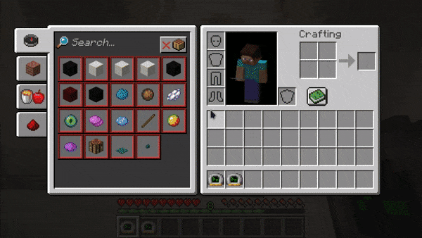
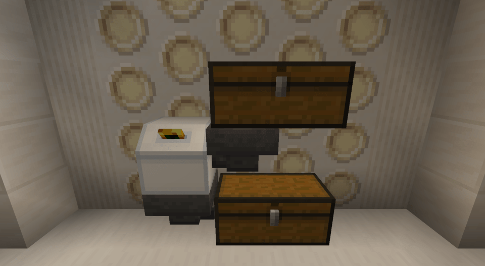

# Dalek Mod Suggestion #354

## Data Module Copier

This mod adds block to quickly copy data from data modules and is based on [suggestion #354](https://discord.com/channels/217396856550981633/273107511400464384/1014296511309422682):
> Data Copier
>
> A new block is added, the Data copier! You put a written Data Module into the red slot, and an unused Data Module into the other, and hit the button. It then copies all the data onto the new module!
>
> It makes the creation of multi-spot waypoints (with /add) much easier, instead of having to make all 10 of them by hand each time, you can instead just copy them directly!

Art is created by Thermo DynAmics with minor tweaks

### Features

- Data Module Copier block
	- Use data module on empty block (or a hopper from above) to insert module to copy
	- Use data module on full block (or a hopper from the side) to insert modules to be copied too
	- Add a hopper below to retreive modules inserted via hopper