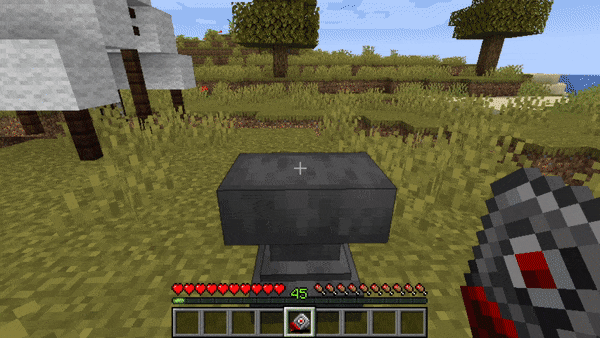

# Dalek Mod Suggestion #371

## Broken (Not Destroyed) Stattenheim Remote 

This mod updates how the Stattenheim Remote works and instead of destroying the remote when it's fully used, it will be disabled and await repairs with circuits. Similar to the Elytra. This addon is based on [suggestion #371](https://discord.com/channels/217396856550981633/273107511400464384/1018205300651733073):
> Fixable Stattenheim Remote
>
> Instead of the stattenheim remote just self-destructing after 10 uses, it becomes a broken form like the elytra when it runs out of durability. It should be repairable using another remote or a redstone circuit.
>
> Instead of having to waste tons of resources on new remotes early game (before enchantments), you can just repair the remote which I belive is more fair (especially if you guys are hellbent on keeping the durability).

### Features

- Stattenheim Remote will no longer destroy when running out of uses
- Stattenheim Remote can be repaired by circuits