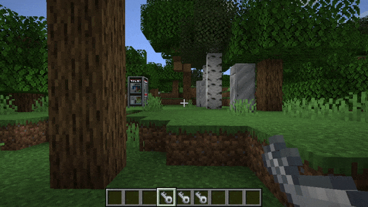

# Dalek Mod Suggestion #77

## TARDIS Key TARDIS Tracker

This mod will make it so using the TARDIS Key will rotate you towards the TARDIS if you're in the same dimension and is based on [suggestion #77](https://discord.com/channels/217396856550981633/273107511400464384/928466575592423434):
> TARDIS Key TARDIS Tracker
>
> Makes it so When you Right Click the Air with a TARDIS Key, It will Point you in the Direction of your TARDIS, not Exact Coords but in a General Direction until you reach your TARDIS
>
> Makes it so Even if you Lose Your Remote or you Don't Have a Remote, you could Find your TARDIS Instead with your Key Guiding you to it.

### Features

- TARDIS Key will rotate towards the TARDIS when being used in the air