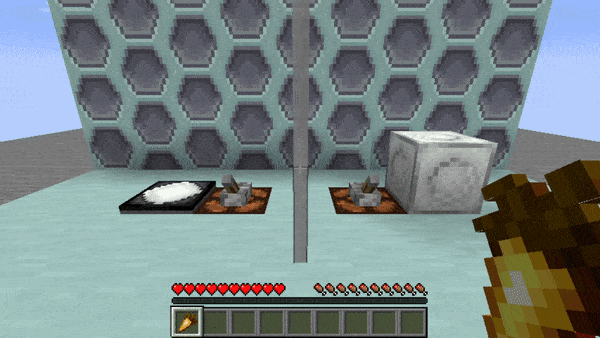

# Dalek Mod Suggestion #122

## TARDIS Key & Remote Keychain

This mod adds the TARDIS Keychain and can hold 5 TARDIS Keys or Remotes in one slot. To add a key, simply hold both in your hand and right click. To swap between the items, shift-right-click in the air. This addon is based on [suggestion #122](https://discord.com/channels/217396856550981633/273107511400464384/929689703639285830):
> KeyRings
>
> you craft together up to 6 keys and 3 remotes and use Shift-Clicking to move through the keys / remotes
>
> it allows people to better manage having multiple tardises or being entrusted to multiple instead of needing to have an inventory full of keys

### Features

- TARDIS Keychain item that can hold up to 5 TARDIS Keys or Remotes