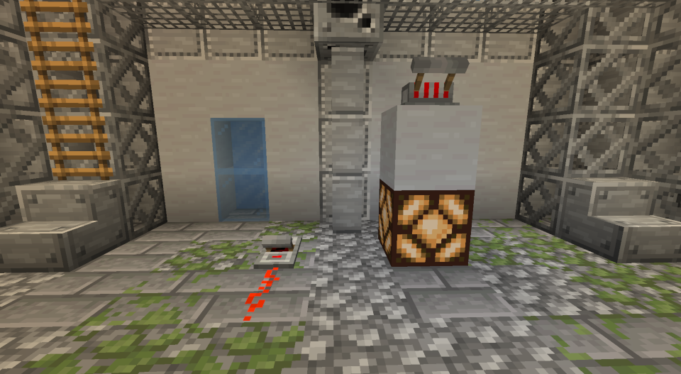

# Dalek Mod Suggestion #198

## Dalek Mod Lever Redstone Interaction

This mod adds the interaction with redstone on DM's levers and is based on [suggestion #198](https://discord.com/channels/217396856550981633/273107511400464384/937843803686068275):
> Redstone integration
>
> Make it so the flight lever for The Dalek Mod, And if wanted also the Flight lever and TARDIM Lever from the TARDIM mod, to emit a redstone signal
>
> It would allow for one to create lights that only get activated when the TARDIS is in flight, or allow for a nicer looking lever for a build

### Features

- Flight Lever interacts with redstone
- Fast Return Lever interacts with redstone