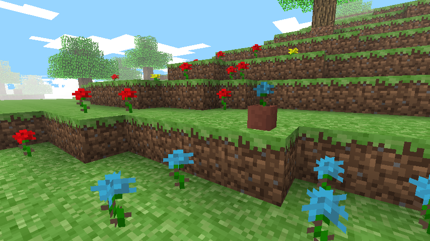

# Dalek Mod Suggestion #74

## Classic Blue Flower

This mod adds simply the classic blue flower and is based on [suggestion #74](https://discord.com/channels/217396856550981633/273107511400464384/928411655166103592):
> Blue Roses and Suspicious Stews
>
> Implements the Blue Rose from Minecraft Pocket Edition, as well as adding all of the mod's new flowers into the pool for suspicious stew recipes (which I believe is handled through code only)
>
> While the blue rose is solely because it's a nice looking block from Minecraft's past, having it and the rest of the flowers in the mod usable for suspicious stews would be a great way to make the mod feel more integrated into the game.

I already added suspicious stew effects to the base mod soon after this suggestion.

### Features

- Adds Classic Blue Flower
  - Generates in Minecraft Classic
  - Suspicious Stew effect is Jump Boost
  - Potted variant