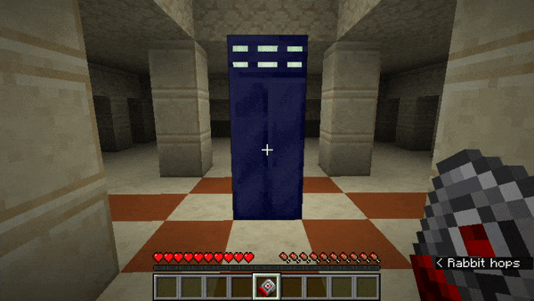

# Dalek Mod Suggestion #525

## Stattenheim Remote Dematting

This mod makes it so you can dematerialise your TARDIS by using the Stattenheim Remote on it and is based on [suggestion #525](https://discord.com/channels/217396856550981633/273107511400464384/1084909225798553630):
> Simple Stattenheim remote change
>
> When right clicking on an active tardis with the stattenheim remote, it dematerializes
>
> When you’re at a location and want your Tardis to be gone but you don’t want it to be in another place, you can dematerialize it from the outside and not be stuck inside

### Features

- Stattenheim Remote now can demat a TARDIS Exterior