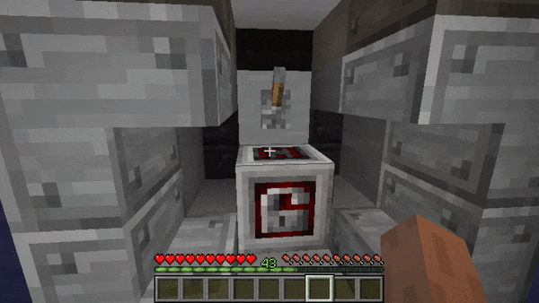
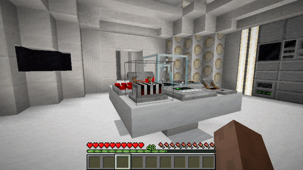
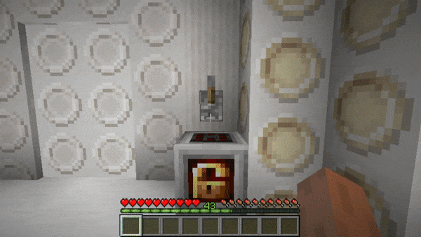

# Dalek Mod Suggestion #98

## Isomorphic Locking Controls / Companions

This mod adds TARDIS companions back in a unique way! Owners can add/remove players from their companion list and others will not be allowed to interact with TARDIS Controls when the Isomorphic Control Block is powered, be weary though, they can still turn off the control! Unless you have a creative-only Super Isomorphic Control Block, which disallows interacting, placing, or breaking anything in the TARDIS. This addon is based on [suggestion #98](https://discord.com/channels/217396856550981633/273107511400464384/929046505850032169):
> Isomorphic Panel
>
> Would allow they player to toggle isomorphic controls on the TARDIS. If anyone else tried to use the controls they'd be shocked (like Ian in An Unearthly Child) and damaged slightly. The owner would also be able to configure it and allow whoever they want to use the controls.
>
> Would add further security for your TARDIS by adding in the permissions functionality from 1.12 as an actual item that can be crafted, meaning that player has to work to get the additional security as an upgrade.

I knew people would forget player griefing is apart of the Minecraft experience and should be honoured with mod development, so I created the creative-mode/super variant. This gives players what they want without **stupid** configurations or gamerules. Servers can then make the decision to enable obtaining the variant with either a datapack, creative shop, or something else. Win-Win.

### Features

- Isomorphic Control Block
  - Allows TARDIS Owners to set companions
  - When powered, players without permissions cannot use TARDIS controls
- Creative/Super Isomororphic Control Block
  - Allows TARDIS Owners to set companions
  - When powered, players without permissions cannot place, break, or interact with anything inside the TARDIS