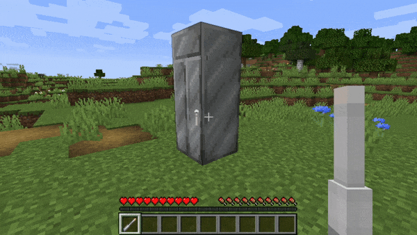

# Dalek Mod Suggestion #166

## TARDIS Sonic Interaction

This mod adds a sonic interaction to dematerialise a TARDIS and is based on [suggestion #166](https://discord.com/channels/217396856550981633/273107511400464384/932747342879293521):
> If you sonic a TARDIS (on the exterior) it will dematerialise
>
> If you use a sonic screwdriver on potentially a new level (level 4) it would have to capacity to dematerialize the TARDIS from the exterior.
>
> It would be quite useful if you are sneaking in a place and don't want the TARDIS to stay there. It would also add a new ability to the sonic screwdriver which I think would be quite favorable. On top of that, I am pretty sure the Doctor used that feature in an episode with the master (the Saxon version). Overall this would be quite a simple but very neat addition to the mod.

### Features

- Sonic now can demat a TARDIS Exterior