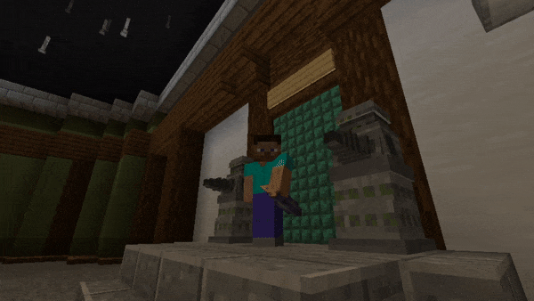

# Dalek Mod Suggestion #443

## Umbrella

This mod adds the 7th Doctor's Umbrella which provides knockback. This addon is based on [suggestion #443](https://discord.com/channels/217396856550981633/273107511400464384/1041314964880756786):
> To add the 7th doctors umbrella and make it act like the wooden cane
>
> I think it should kinda be like a cane but if you would crouch it would extend and the part of it i want to be cane like is the knock back
>
> Not much benifit its more for style and knock back

### Features

- Umbrella Item
  - Provides knockback
  - Shift-right-click to open/close
