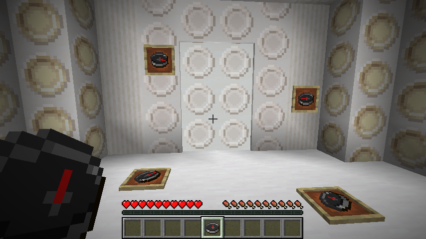

# Dalek Mod Suggestion #260

## TARDIS Exit Compass

This mod makes it so when inside the TARDIS interior, a compass will point towards the door and is based on [suggestion #260](https://discord.com/channels/217396856550981633/273107511400464384/954295357355986944):
> compass door
>
> when you are in the tardis dimension, the compass just spins around like its in the nether, it would be fun to have it point to the interior door
>
> there isnt really a reason to add it, just a small thing for people to find and say "oh thats neat" kinda like the portal tardis door, and the other types of doors.

### Features

- Non-Lodestone Compasses point towards interior-door-pos in the TARDIS interior