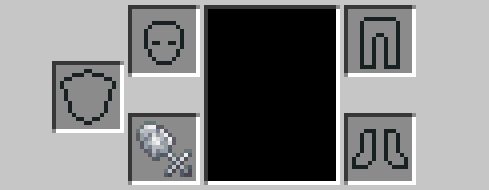

# Dalek Mod Suggestion #486

## Tardis Key Perception Filter

This mod allows you to wear the TARDIS Key to become invisible and is based on [suggestion #486](https://discord.com/channels/217396856550981633/273107511400464384/1066991909018537994):
> Perception filter keychain
>
> in I believe season 3 the 10th doctor uses the Tardis keys to make himself almost invisible to hide from the master. So I am suggesting an item that the TARDIS key can be used for is a necklace that makes you almost invisible. It would remove your name tag while being worn, but make you have 90%/85% opacity making you almost invisible. it only works if you have no armor on. If you hit a mob while wearing it it will see you like normal invis. the invis last 1 minute. and can be crafted using a lead a TARDIS key and a Redstone circuit
>
> it would be a great addition to the key list and a alternative to invis pots, while not out saying its quality as an invis item

### Features

- Putting Tardis Key in ChestPlate slot gives Invisibility