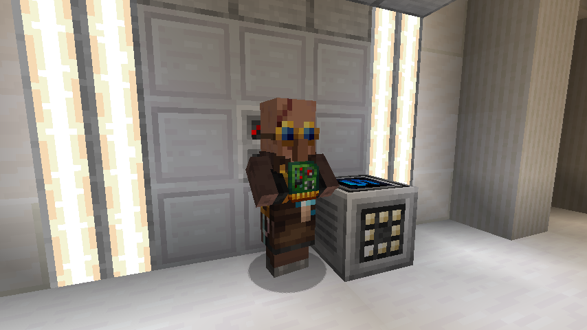

# Dalek Mod Suggestion #237

## Dalek Mod Villager

This mod adds the TARDIS Technician Villager and is based on [suggestion #237](https://discord.com/channels/217396856550981633/273107511400464384/948291075477483551):
> Ars villagers
>
> Add a villager varient that it's profession could be a time lord or something, it would get this profession by placing the architectural reconfiguration software next to it, this would make it sell different TARDIS items, keys remotes, and some hard to aquire TARDIS blocks. You could also sell plastic for emeralds
>
> This could help integrate dalek mod Into already made vanilla features, making it seem more like a full game instead of just an addon. On a more player based level, this could help players get certain TARDIS items they want, or sell TARDIS items they don't need.

### Features

- TARDIS Technician Villager
  - Job Site: Architectural Reconfig System
  - Interested Blocks: TARDIS, TARDIS Seed
  - Trades:
    - Novice:
      - 15 Plastic Chunks -> 1 Emerald (Max 12) (1 Villager XP) (0.2 Multiplier)
      - 15 Silicon -> 1 Emerald (Max 12) (1 Villager XP) (0.05 Multiplier)
      - 20 Cinnabar -> 1 Emerald (Max 16) (1 Villager XP) (0.05 Multiplier)
      - 20 Zeiton -> 1 Emerald (Max 16) (1 Villager XP) (0.05 Multiplier)
    - Apprentice:
      - 5 Circuits -> 1 Emerald (Max 12) (1 Villager XP) (0.2 Multiplier)
      - 4-7 Stainless Steel Ingot -> 1 Emerald (Max 12) (3 Villager XP) (0.05 Multiplier)
      - 1 Emerald & 1 Circuit -> Random Chameleon Circuit (Max 3) (3 Villager XP) (0.2 Multiplier)
    - Journeyman:
      - 4-7 Dalekanium Ingot -> 1 Emerald (Max 12) (4 Villager XP) (0.05 Multiplier)
      - 4 Emerald -> 1 Discarded Plunger (Max 12) (4 Villager XP) (0.2 Multiplier)
    - Expert:
      - 1 Sonic Emitter -> 1 Emerald (Max 12) (3 Villager XP) (0.2 Multiplier)
      - 1 Emerald & 1 Circuit -> Random Chameleon Circuit (Max 3) (3 Villager XP) (0.2 Multiplier)
    - Master:
      - 1 Emerald & 1 Circuit -> Random Chameleon Circuit (Max 3) (3 Villager XP) (0.2 Multiplier)
      - 1 Emerald & 1 Stick -> Sonic Screwdriver (Max 1) (7 Villager XP) (0.05 Multiplier)
