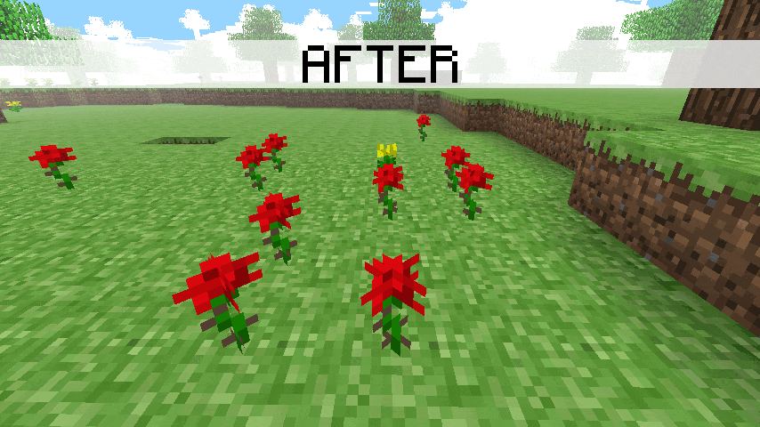

# Dalek Mod Suggestion #68

## Centered Classic Flowers

This mod is a small change to center the classic flowers and is based on [suggestion #68](https://discord.com/channels/217396856550981633/273107511400464384/928316895134875668):
> Minor Visual Aesthetic Addition To Classic/Infdev/Beta Flowers and Mushrooms
>
> One of the updates in the last few years of minecraft has made it so all flowers spawn off-centre from the block itself. I propose that the classic flowers and mushrooms where applicable spawn on the centre of the block it's placed on top of.
>
> It is not something I am requesting as a priority thing but as a Somewhere Down The Line thing. Just a little bit of fixing anachronisms.

### Features

- Classic Red Flower is now centered
- Classic Yellow Flower is now centered