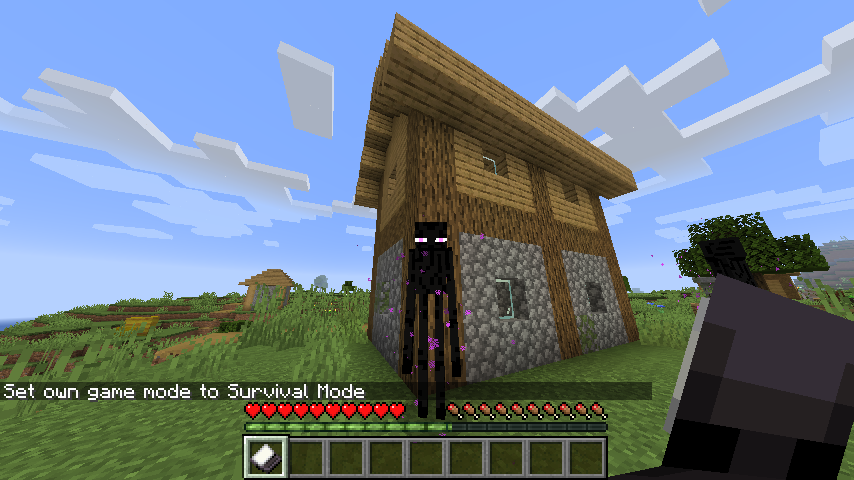

# Dalek Mod Suggestion #1

## Psychic Paper

This mod adds Psychic Paper to the mod and is based on [suggestion #1](https://discord.com/channels/217396856550981633/273107511400464384/919059902423531541):
> Psychic paper
>
> Could be used to negate endermen by having it in your inventory could also improve villager trades and wandering trader trades.
>
> Would be able to improve players survival experience and remove the need to wear a pumpkin, which is a pain.

### Features

- When **Psychic Paper** is held in either hand, will disable Endermen's anger when making eye contact
- When **Psychic Paper** is in inventory, Villager trading is discounted
- Advancement for crafting **Psychic Paper**
- Advancement when Villager trading with **Psychic Paper**