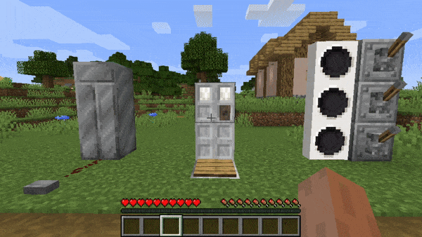

# Dalek Mod Suggestion #154

## TARDIS / Police Box / Roundel Door Redstone Interaction

This mod adds redstone interaction to the TARDIS doors and is based on [suggestion #154](https://discord.com/channels/217396856550981633/273107511400464384/932213037409140777):
> Tardis exterior and interior doors can be activated by pressure plates.
>
> Like any door in Minecraft would react when a pressure plate is used on them.
> 
> You could make it so both doors open, or just one of the doors reacts.
> 
> Roundel doors will still take longer to open when pressure is applied but if the pressure isn’t applied half way through the door opening, the door just starts closing again.
>
> It would integrate the mod further into Minecraft style gameplay. It’s benefits the play for the same reason people put pressure plates down at their doors in bases, it is a safety feature as mobs will be shut out as you walk in, plus a convenience since you don’t have to click the doors.

### Features

- TARDIS Exterior redstone interaction
- Police Box Doors redstone interaction
- Roundel Doors redstone interaction