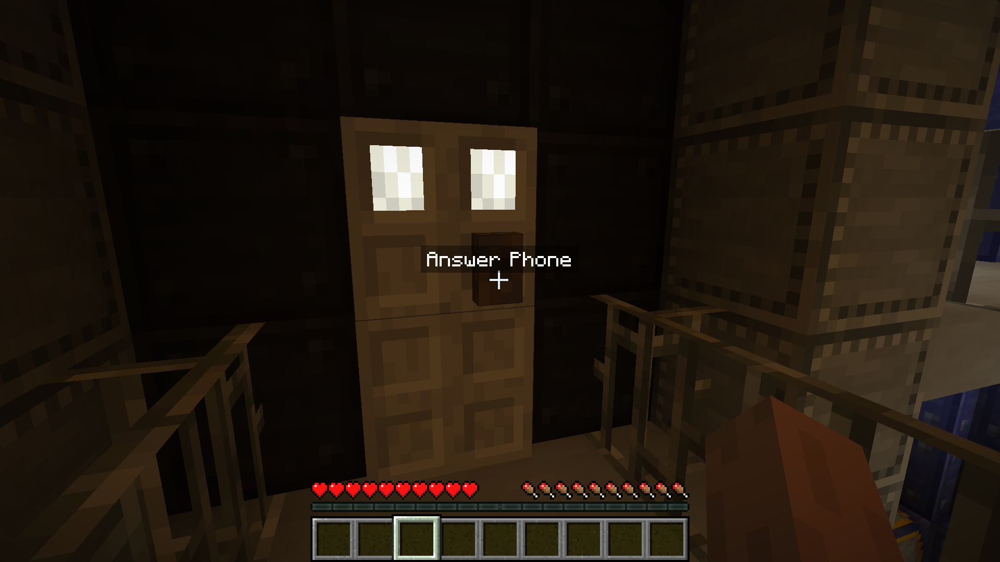
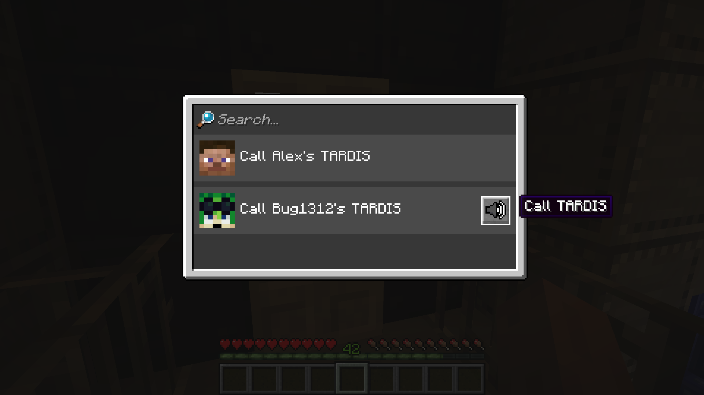

# Dalek Mod Suggestion #7

## TARDIS Phone Calls

This mod adds Simple Voice Chat integration with TARDIS phonecalls and is based on [suggestion #7](https://discord.com/channels/217396856550981633/273107511400464384/919723482730885261):
> Have a working phone on police box tardises
>
> Allow the player to open the phone hatch on the policeboxes and they could call other peoples tardises and have this use some sort of voice chat implementation to talk to friends
>
> It would be quite useful as communication on dmu with other players

### Features

- Police box interior doors now have phone interactions where phone box is placed
- Call list containing all TARDISes with police box doors and people inside. Itemized as "Call \<Owner>'s TARDIS"
- When a TARDIS is being called, a ringer is played
- Starting a call or answering a call will add you to a Simple Voice Chat group