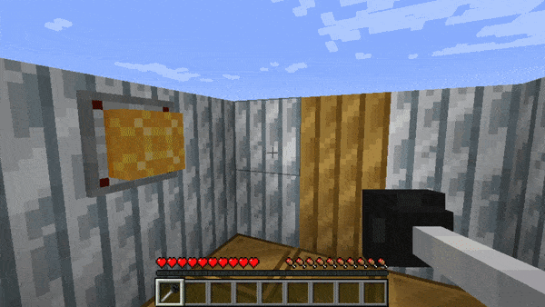

# Dalek Mod Suggestion #174

## Time Ring

This mod adds a Time Ring like item to teleport players to their TARDIS is based on [suggestion #174](https://discord.com/channels/217396856550981633/273107511400464384/934162701108789258):
> a Time Ring.
>
> So in the episode genesis of the daleks (classic who) the doctor is transmatted to skaro by a time lord so he could try and change the genetics of a dalek in their early stages of being created and other stuff. Anyways he is given a “Time Ring” by the other time lord and what it does is it teleports the doctor back to his tardis when he has completed his mission. But, i thought it would be a cool feature for new players in or outside of dmu if they don’t have a tardis key yet but have a tardis and don’t want to lose it. Maybe the recipe could be easier to create and make it easier to obtain than a tardis key? or it could be a dmu specific thing that you can just buy in the shop.
>
> It could benefit new players that are just starting off with the mod in or outside of dmu. It could be easier to obtain than a tardis key so you don’t lose your tardis and have to ask a mod to find it with the coords you (potentially) wrote down or find it manually in a survival world.

### Features

- Time Ring