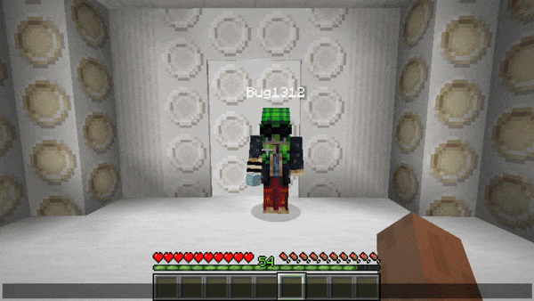

# Dalek Mod Suggestion #242

## TARDIS Siege Mode

This mod adds the ability to put your TARDIS into Siege Mode, allowing players to pick it up and move it around. This addon is loosely based on [suggestion #242](https://discord.com/channels/217396856550981633/273107511400464384/949191497037795368):
> Tardis Shrinks
>
> TARDIS shrinks to a small box when is badly damaged
>
> Imagine being able to pick up the tardis when it's too damaged and placing it somewhere else to "heal" sorta speaking.

### Features

- Siege Lever with glass shield to prevent Siege Mode misclicks
- Siege Mode TARDIS which can be picked up and dropped by players to transport the TARDIS
- Advancement for activating Siege Mode for the first time