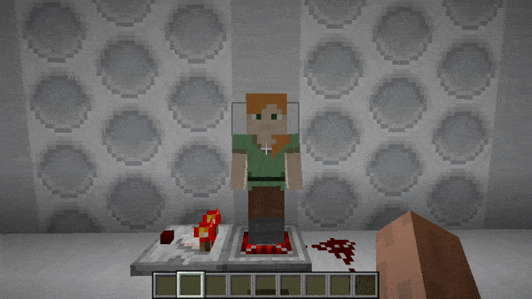

# Dalek Mod Suggestion #62

## Hologram Toggle

This mod adds redstone toggle states for the Hologram, similar to the Copper Bulb and is based on [suggestion #62](https://discord.com/channels/217396856550981633/273107511400464384/928281771961880617):
> Make holograms toggleable.
>
> Holograms are one of the coolest blocks in the mod, but they can be even cooler: i suggest that using redstone activators (like levers or buttons) it would be possible to turn off and on the hologram.
>
> To be honest there is not much that would improve gameplay on itself, but imagine the possibilities that this change offers.

### Features

- Hologram now toggles when powered
- Hologram outputs max signal strength via comparator when toggled on